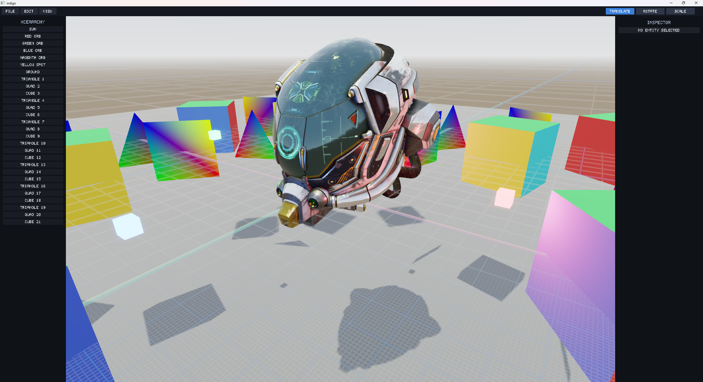

# indigo

A data-oriented Go game engine. Archetype ECS, a wgpu-backed render graph, and a retained ECS-driven UI sit on top of a small substrate that runs on the desktop through GLFW and in the browser through WebAssembly + canvas. Engine state lives as components on world entities, systems are plain `func(*ecs.World)` functions, and the renderer reads from the same world the simulation writes to.

The editor and a breakout demo ship in this repository as the two end-to-end consumers.

[Editor in the browser](https://matthewberger.dev/indigo/editor/) (WebGPU required).

[Breakout in the browser](https://matthewberger.dev/indigo/breakout/).

Architecture notes are in [docs/ARCHITECTURE.md](docs/ARCHITECTURE.md).

Dual-licensed under [MIT](LICENSE-MIT) or [Apache-2.0](LICENSE-APACHE) at your option.
